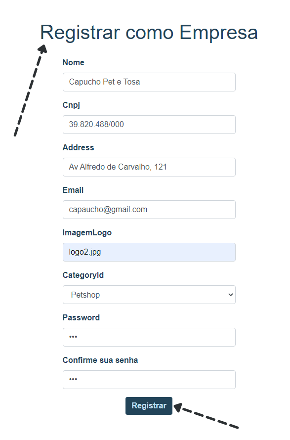
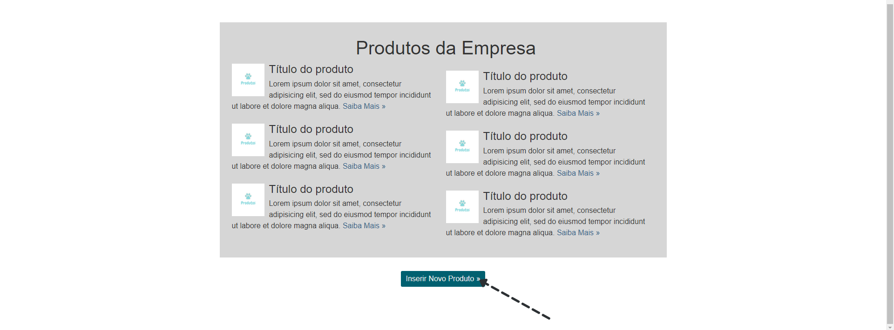
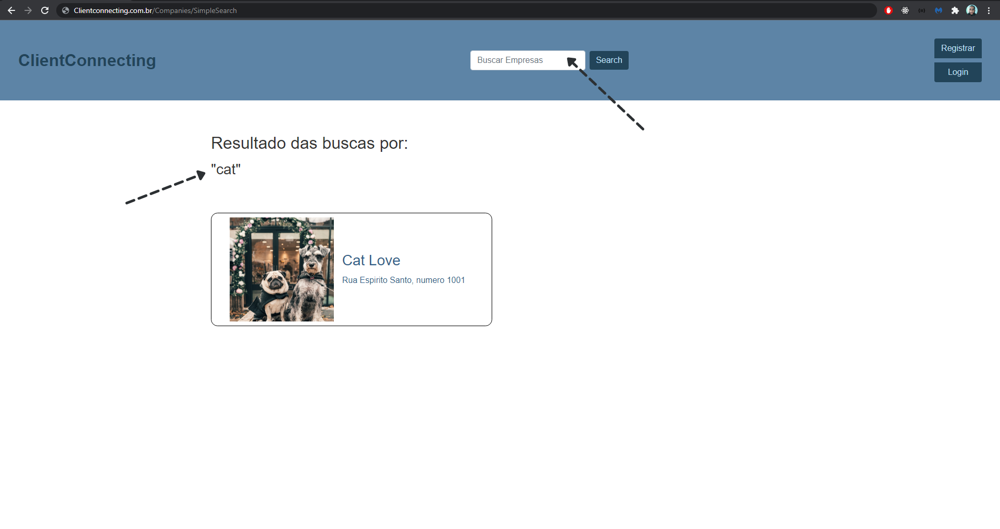

# Registro de Testes de Software

|T01 - Fazer Cadastro|Prints|
|:---:|---|

|T02- Inserir Produtos (Empresa).|Prints|
|:---:|---|

|T03 - Pesquisar serviços e produtos (Cliente).|Prints|
|:---:|---|

|T04 - Editar informações de perfil|Prints|
|:---:|---|

## Avaliação

Discorra sobre os resultados do teste. Ressaltando pontos fortes e fracos identificados na solução. Comente como o grupo pretende atacar esses pontos nas próximas iterações. Apresente as falhas detectadas e as melhorias geradas a partir dos resultados obtidos nos testes.

> **Links Úteis**:
> - [Ferramentas de Test para Java Script](https://geekflare.com/javascript-unit-testing/)
