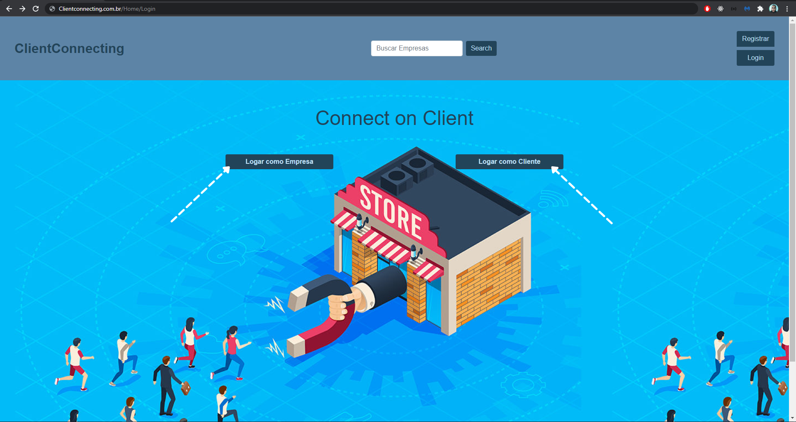
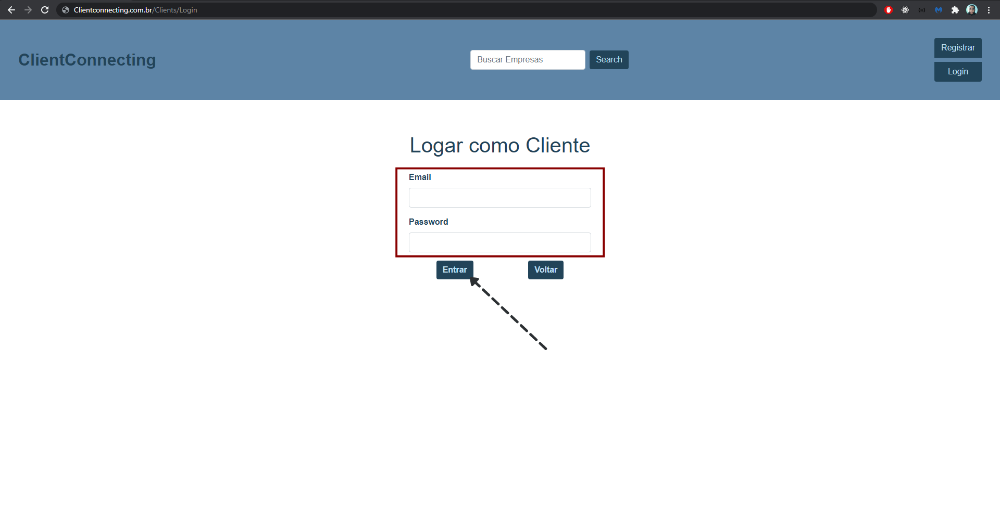
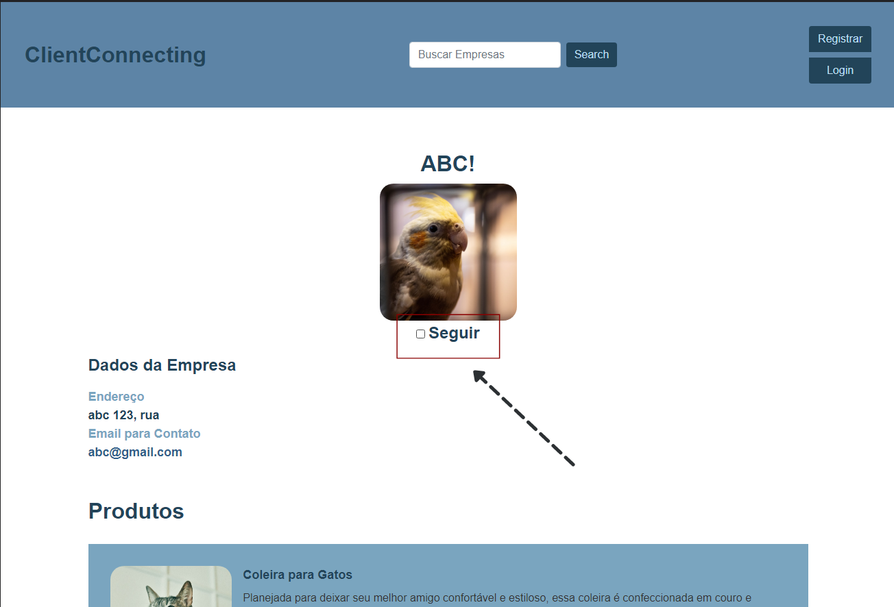
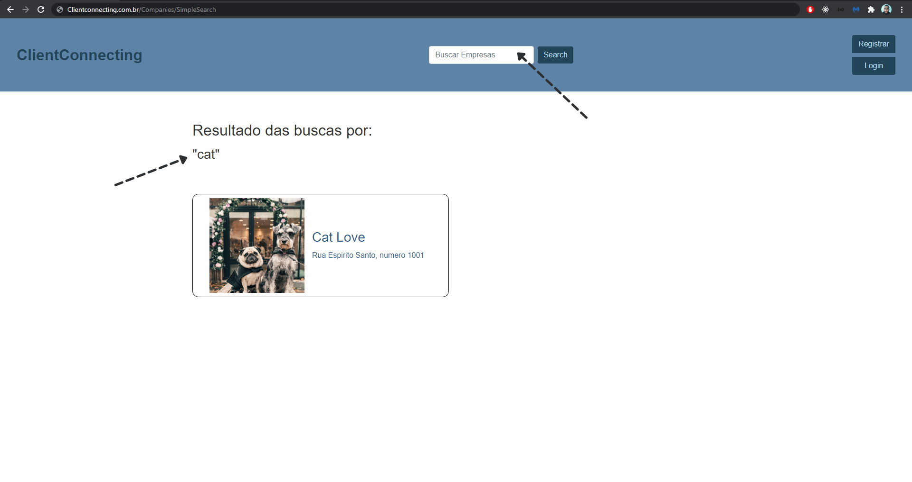
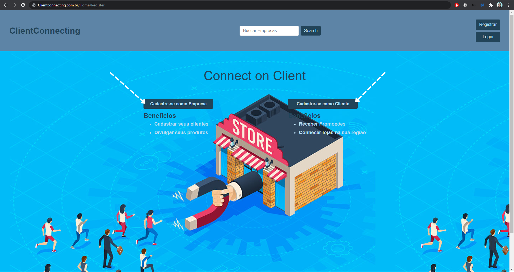
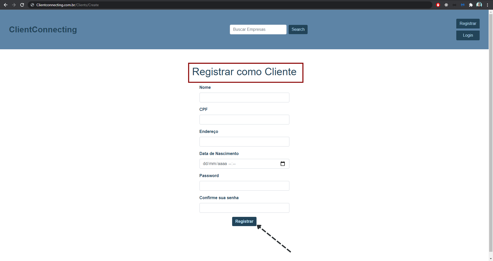
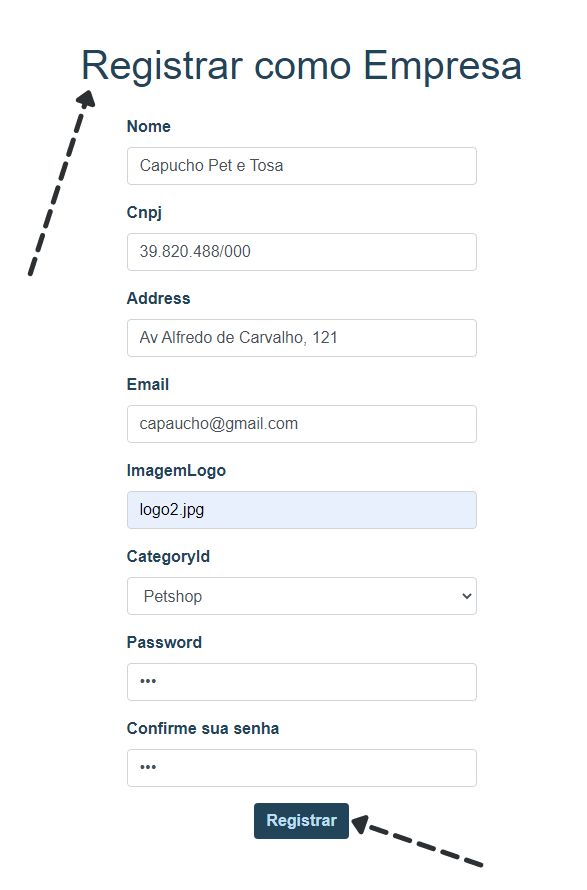
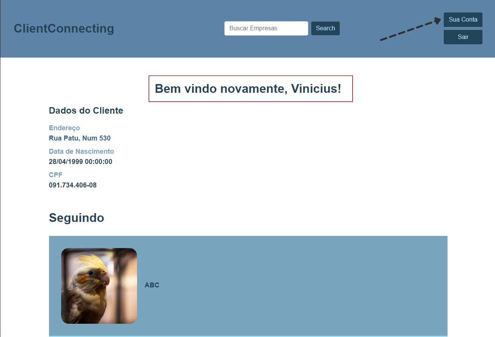
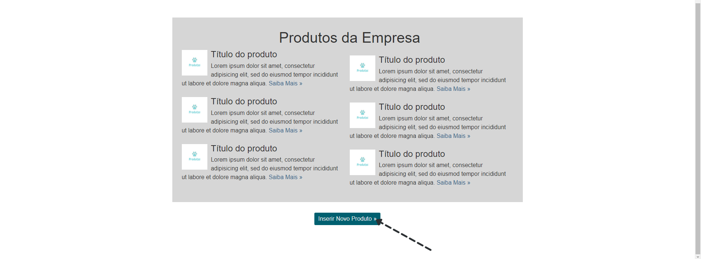
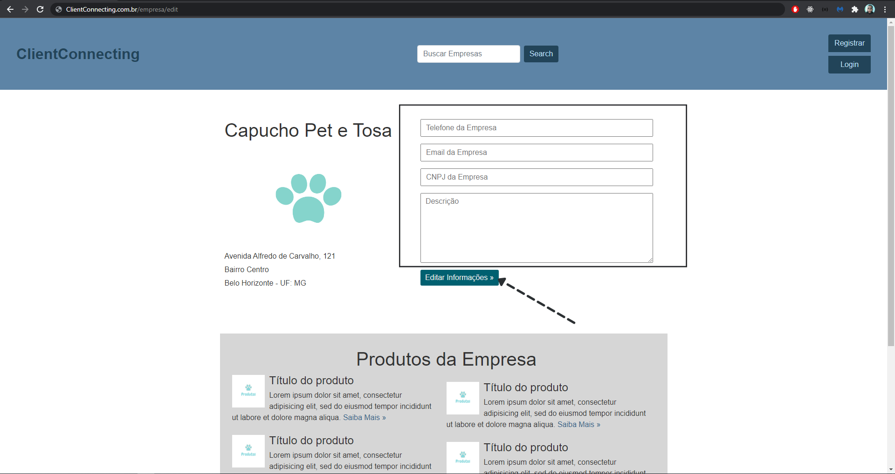

# Registro de Testes de Usabilidade

|Prints|T01 - Acesso aos produtos da empresa|
|:---:|---|

|Prints|T02 - Acesso a tela inicial da plataforma|
|:---:|---|

|Prints|T03 - Fazer cadastro|
|:---:|---|

|Prints|T04 - Fazer login|
|:---:|---|

|Prints|T05- Inserir Produtos (Empresa).|
|:---:|---|

|Prints|T06 - Pesquisar serviços e produtos (Cliente).|
|:---:|---|

|Prints|T07 - Editar informações de perfil|
|:---:|---|

> **Links Úteis**:
> - [Ferramentas de Testes de Usabilidade](https://www.usability.gov/how-to-and-tools/resources/templates.html)
